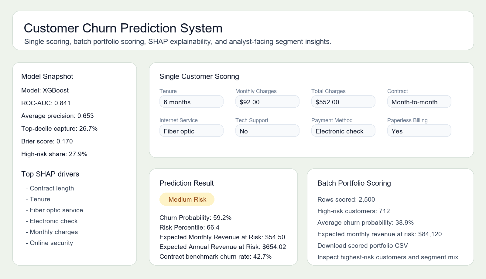

# Customer Churn Prediction System

End-to-end telecom churn analytics and machine learning system built with Python, Scikit-learn, XGBoost, SHAP, and Streamlit.

## Executive Summary

This project is designed as a portfolio-ready case study for both Data Analyst and Data Scientist roles. It goes beyond a simple churn classifier by combining:

- business-focused exploratory analysis
- revenue-at-risk segmentation
- production-style preprocessing and inference
- model comparison and threshold optimization
- calibration, lift, and error analysis
- SHAP explainability
- a Streamlit app for single-customer and batch portfolio scoring

The goal is not only to predict churn, but to help a telecom business decide which customers to prioritize, why they are at risk, and how much revenue is exposed.

## Business Problem

Subscription businesses lose revenue when customers cancel their services. Retention teams need an early warning system that can:

- rank customers by churn risk
- identify the segments creating the most revenue exposure
- explain which commercial and service factors are pushing risk up
- support targeted retention actions such as contract migration, pricing review, and support bundling

## Dataset

The project uses the IBM Telco Customer Churn dataset.

- Raw rows: `7,043`
- Cleaned rows: `7,032`
- Overall churn rate: `26.58%`
- Target variable: `Churn`

The feature space includes:

- demographics: `gender`, `SeniorCitizen`, `Partner`, `Dependents`
- commercial variables: `Contract`, `PaymentMethod`, `PaperlessBilling`
- service adoption: `InternetService`, `TechSupport`, `OnlineSecurity`, `StreamingTV`, `StreamingMovies`
- value signals: `tenure`, `MonthlyCharges`, `TotalCharges`

## Repository Structure

```text
customer-churn-prediction-system/
|-- app/
|   `-- streamlit_app.py
|-- data/
|   |-- processed/
|   `-- raw/
|-- models/
|   `-- churn_model.pkl
|-- notebooks/
|   |-- 01_data_audit.ipynb
|   |-- 02_eda_analysis.ipynb
|   |-- 03_preprocessing.ipynb
|   `-- 04_model_training.ipynb
|-- reports/
|   |-- figures/
|   |-- calibration_table.csv
|   |-- error_analysis.csv
|   |-- feature_importance.csv
|   |-- lift_table.csv
|   |-- model_comparison.csv
|   |-- priority_segments.csv
|   |-- segment_kpis.csv
|   |-- shap_feature_importance.csv
|   |-- test_predictions.csv
|   `-- threshold_comparison.csv
|-- src/
|   |-- analytics.py
|   |-- predict.py
|   |-- preprocessing.py
|   `-- train_model.py
`-- requirements.txt
```

## Workflow

### 1. Data Audit and Cleaning

Notebook: [notebooks/01_data_audit.ipynb](notebooks/01_data_audit.ipynb)

Main actions:

- converted `TotalCharges` to numeric
- removed invalid rows with missing converted charges
- dropped duplicate rows
- removed `customerID`
- saved the cleaned dataset to `data/processed/clean_telco_churn.csv`

### 2. Exploratory Data Analysis

Notebook: [notebooks/02_eda_analysis.ipynb](notebooks/02_eda_analysis.ipynb)

The EDA combines visual analysis with analyst-style segment KPIs and revenue-at-risk analysis.

Key business observations:

- month-to-month customers churn at `42.71%`
- fiber optic customers churn at `41.89%`
- electronic check customers churn at `45.29%`
- customers without tech support churn at `41.65%`
- churned customers average `17.98` months of tenure vs `37.65` for retained customers
- churned customers pay higher monthly charges: `$74.44` vs `$61.31`

Priority risk segments from the scored population include:

- `Contract: Month-to-month`
- `InternetService: Fiber optic`
- `TechSupport: No`
- `PaymentMethod: Electronic check`
- `tenure_bucket: 0-12 months`

### 3. Preprocessing Pipeline

Notebook: [notebooks/03_preprocessing.ipynb](notebooks/03_preprocessing.ipynb)

The preprocessing logic is shared across training and inference:

- target mapping: `Yes -> 1`, `No -> 0`
- train/test split with `stratify=y`
- one-hot encoding via `pd.get_dummies(..., drop_first=True)`
- scaling of numerical columns with `StandardScaler`
- saved preprocessing metadata for schema alignment during inference

### 4. Model Training and Optimization

Notebook: [notebooks/04_model_training.ipynb](notebooks/04_model_training.ipynb)

Models trained:

- Logistic Regression
- Random Forest
- XGBoost

Class imbalance handling:

- balanced class weights for the baseline models
- `scale_pos_weight = 2.763` for XGBoost

XGBoost tuning grid:

- `n_estimators`
- `max_depth`
- `learning_rate`
- `subsample`
- `colsample_bytree`

Best XGBoost parameters:

```python
{
    "colsample_bytree": 0.8,
    "learning_rate": 0.01,
    "max_depth": 3,
    "n_estimators": 400,
    "subsample": 0.8,
}
```

## Model Performance

| Model | Accuracy | Precision | Recall | F1 Score | ROC-AUC | Average Precision |
| --- | ---: | ---: | ---: | ---: | ---: | ---: |
| XGBoost | 0.727 | 0.492 | 0.821 | 0.615 | 0.841 | 0.653 |
| Logistic Regression | 0.725 | 0.489 | 0.794 | 0.606 | 0.835 | 0.619 |
| Random Forest | 0.772 | 0.563 | 0.634 | 0.596 | 0.830 | 0.625 |

The production model is `XGBoost` because it gives the strongest ROC-AUC and the best churn recall among the evaluated candidates.

## Threshold Strategy

The deployed threshold is `0.40` to favor higher churn capture.

| Threshold | Accuracy | Precision | Recall | F1 Score |
| --- | ---: | ---: | ---: | ---: |
| 0.50 | 0.727 | 0.492 | 0.821 | 0.615 |
| 0.40 | 0.683 | 0.451 | 0.880 | 0.596 |

Interpretation:

- `0.50` gives better accuracy and precision
- `0.40` captures more churners, which is valuable for retention outreach

## Probability Quality and Ranking Performance

This project includes stronger model diagnostics than a standard tutorial:

- average precision: `0.653`
- Brier score: `0.170`
- top-decile churn capture: `26.7%`

Saved assets:

- calibration curve: [reports/figures/calibration_curve.png](reports/figures/calibration_curve.png)
- precision-recall curve: [reports/figures/precision_recall_curve.png](reports/figures/precision_recall_curve.png)
- lift analysis: [reports/figures/lift_analysis.png](reports/figures/lift_analysis.png)
- lift table: [reports/lift_table.csv](reports/lift_table.csv)

These diagnostics show whether the model is useful as a ranking system and whether its predicted probabilities are directionally reliable for operational use.

## Explainability

Two explainability layers are included:

- global importance from the model
- SHAP-based local explanation for an individual customer

Top SHAP features:

1. `Contract_Two year`
2. `tenure`
3. `InternetService_Fiber optic`
4. `Contract_One year`
5. `PaymentMethod_Electronic check`
6. `InternetService_No`
7. `MonthlyCharges`
8. `OnlineSecurity_Yes`

Artifacts:

- SHAP importance table: [reports/shap_feature_importance.csv](reports/shap_feature_importance.csv)
- SHAP importance figure: [reports/figures/shap_feature_importance.png](reports/figures/shap_feature_importance.png)

## Error Analysis

The pipeline also surfaces where the model struggles by segment.

Examples from the current outputs:

- `Contract: Two year` has a high false negative rate because churn is rare in that segment
- `TechSupport: Yes` still creates false negatives that matter for retention programs
- mature tenure buckets can contain low-frequency churners that are harder to catch

Artifacts:

- error analysis table: [reports/error_analysis.csv](reports/error_analysis.csv)
- error analysis figure: [reports/figures/error_analysis.png](reports/figures/error_analysis.png)

## Revenue-at-Risk Analysis

This project adds a business prioritization layer by estimating expected revenue at risk.

Portfolio-level outputs from the scored reference population:

- expected monthly revenue at risk: `$212,115.82`
- expected annual revenue at risk: `$2,545,389.86`
- high-risk customer share: `27.93%`

Priority segment artifact:

- segment KPI table: [reports/segment_kpis.csv](reports/segment_kpis.csv)
- top priority segments: [reports/priority_segments.csv](reports/priority_segments.csv)
- segment revenue figure: [reports/figures/segment_revenue_at_risk.png](reports/figures/segment_revenue_at_risk.png)

## Streamlit Application

App entry point: [app/streamlit_app.py](app/streamlit_app.py)

The dashboard supports:

- single-customer churn scoring
- expected monthly and annual revenue-at-risk estimates
- benchmark percentile vs the reference population
- segment benchmark lookups
- SHAP-based local explanation
- batch CSV scoring for a customer portfolio
- downloadable scored output for analyst workflows

Dashboard preview:



## Source Modules

- [src/preprocessing.py](src/preprocessing.py): data cleaning, preprocessing artifacts, schema validation
- [src/train_model.py](src/train_model.py): training, tuning, evaluation, calibration, lift, SHAP, segment analysis
- [src/predict.py](src/predict.py): single and batch scoring, benchmark percentile, local explanation
- [src/analytics.py](src/analytics.py): shared business bucketing and segment summarization helpers

## How to Run

Install dependencies:

```bash
pip install -r requirements.txt
```

Regenerate the clean data, reports, and trained artifact:

```bash
python src/train_model.py
```

Run a sample CLI prediction:

```bash
python src/predict.py
```

Launch the Streamlit dashboard:

```bash
streamlit run app/streamlit_app.py
```

If `streamlit` is not on your PATH:

```bash
python -m streamlit run app/streamlit_app.py
```

## Why This Project Is Stronger Now

Compared with a typical beginner churn project, this repository now demonstrates:

- analyst-style segment KPI thinking
- revenue-at-risk prioritization
- model probability diagnostics
- error analysis by business segment
- local explainability for one prediction
- batch scoring for practical workflow use
- cleaner separation between training, inference, and presentation layers

That makes it materially stronger for fresher Data Analyst and Data Scientist portfolios.
